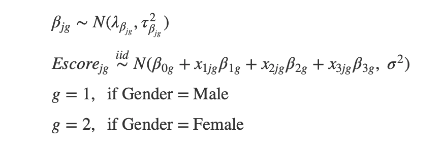

**Big 5 Personality Test Bayesian Regression Analysis**

**Introduction:**

Everyone has different personalities made up of multiple attributes. Many tests exist to classify people according to their personalities and to better understand the brain. One of these tests is the Big5 personality test which breaks down every personality into 5 categories openness, conscientiousness, agreeableness, neuroticism and extraversion. 

The idea for this project came because of Jonathan’s internship at Mental Gurus, a group therapy mental health website where fellow Gurus can use social media, personality tests, and mental health data to help each other through their personal struggles. Mental Gurus wants to identify if a relationship exists between the extraversion score and the other personality attributes from the Big5 personality test, so the data science team can shorten the Mental Gurus personality tests through predicting personality accurately with less survey questions.  

**Research Question:**

Is extraversion score, from the Big5 personality test, affected by the other personality attributes? (Openness, conscientiousness, agreeableness and neuroticism.) Are the effects of the other personality attributes on extraversion score different for males and females? If there is a difference between genders, we can use that prior knowledge to make Mental Guru’s personality tests catered to gender.

We performed a linear regression, and will examine the parameters in the linear regression model. 

**Regression Model:** 					



**Parameters of Interest:**


**Data Collection:**

The Big5 personality test results are on Open Psychometrics, an open source psychology data website. The Big5 personality data has about 20000 different responses, with gender, race, age, native english speaker, right-handed or left-handed, source of response, country, and scores as the variables. The personality scores are summarized on a scale from 0-40. The mean extraversion score is 19.54 for males and 20.47 for females.

**Likelihood:**


The normal distribution for the Escore is appropriate because the histogram of Escore is normal. 

**Prior Distributions:**

Using normals as the priors is appropriate because the Betas follow a normal distribution and it is a conjugate distribution. The prior inverse gamma distribution is typically used for variance parameters because the distribution is positive and conjugate. 


We chose a wide variance and a mean of 0 as the prior parameters for the Betas, because we don’t have any strong prior beliefs. For the variance we also used a wide distribution. We used the same prior parameters for both females and males.


**Describe & Summarize Posterior Distribution:**

Below is a table which summarizes the posterior distribution of the differences (males - females). The table includes the posterior mean of the beta values, their respective 90% credible intervals, and the probability of the betas being above 0. After our analysis, we found that the coefficient for neuroticism score and the variance are significant.


```
------------------------------------------------------------------------------
      Coefficient     Mean    Lower Bound   Upper Bound   Probability Above 0 
------------------- -------- ------------- ------------- ---------------------
Intercept     	-0.7042   -2.002        1.825         0.4862        

Agreeableness    	-0.0104   -0.06032      0.01605       0.1785        

Neuroticism    	0.02595   0.002667      0.04954       0.966        

Openness      	-0.00198  -0.0869       0.04315       0.3158        

Variance      	-2.752    -5.048        -0.3785       0.02853       
-------------------------------------------------------------------------------
```


Given our data and prior knowledge, there is a 90% probability that the true difference in neuroticism coefficient is between 0.002667 and  0.04954.


**Results:**

Full conditional on sigma				  


Full conditional on beta


Full Conditional on intercept


**Conclusion: **

_Is extraversion score, from the Big5 personality test, affected by the other personality attributes?_

Looking at the regression model, openness, neuroticism, agreeableness, and gender all are significant predictors for extraversion.

_Are the effects of the other personality attributes on extraversion score different for males and females?_

Using a 90% credible interval, as neuroticism increases, extroversion increases more for males compared to females.

We also found that the variance is significantly greater for females.

**Posterior vs. Prior Comparison**

Initially we set priors with wide distributions to reflect a lack of prior knowledge. The prior distribution for neuroticism for both genders has a mean of about 0 but a wide variance. After the analysis, we found that the posterior for neuroticism is on average .264 for males and .238 for females: holding all else constant, for males, extraversion increases by about .264 points for each point increase in neuroticism on average. For females, holding all else constant, extraversion increases by about .238 points for each point increase in neuroticism. 

**Limitations**

One limitation in the data is the model has slight multicollinearity issues between N and O scores. This could cause inflated standard errors, decrease statistical power, and affect our estimates. For a better model, we should fix this assumption.

Another limitation is the choice of our priors. We chose wide priors because of a lack of prior knowledge; however, because we have so much data the priors will not have hardly any effect on the posteriors.

**Further studies**

The next step would be to do the same analysis with the other 4 personality traits as the response. Another question to look into is to quantify how much more neuroticism increases extroversion for males compared to females.

**Appendix:**

[https://rstudio.cloud/spaces/12195/project/736008](https://rstudio.cloud/spaces/12195/project/736008)

---

title: "251 Personality Regression"

author: "Jonathan Chia"

date: "November 19, 2019"

output: html_document

---

```{r setup, include=FALSE}

knitr::opts_chunk$set(echo = TRUE)

library(tidyverse)

library(ggfortify)  # plot glmnet objects using ggplot instead of base R

library(car)  # needed for VIFs

library(corrplot)  # for colored correlation matrix plot

library(bestglm)  # for stepwise methods

library(glmnet) 

```

Read in the data

```{r}

big5 <- read.csv("/cloud/project/data.csv", header = TRUE, stringsAsFactors = FALSE, sep = "")

```

Create Scores

```{r}

big5 <- big5 %>% mutate(Escore = 20 + E1 - E2 + E3 - E4 + E5 - E6 + E7 - E8 + E9 - E10)

big5 <- big5 %>% mutate(Ascore = 14 - A1 + A2 - A3 + A4 - A5 + A6 - A7 + A8 + A9 + A10)

big5 <- big5 %>% mutate(Cscore = 14 + C1 - C2 + C3 - C4 + C5 - C6 + C7 - C8 + C9 + C10)

big5 <- big5 %>% mutate(Nscore = 38 - N1 + N2 - N3 + N4 - N5 - N6 - N7 - N8 - N9 - N10)

big5 <- big5 %>% mutate(Oscore = 8 + A1 - A2 + A3 - A4 + A5 - A6 + A7 + A8 + A9 + A10)

big5$genderM <- ifelse(big5$gender == 1, 1, 0)

#####Bayesian Regression

###Setup

```{r}

#Group males together

big5.m <- big5.subset %>% filter(genderM == 1)

n <- length(big5.m$Escore)

Escore <- big5.m$Escore

Nscore <- big5.m$Nscore

Oscore <- big5.m$Oscore

Ascore <- big5.m$Ascore

#########################

# Prior distributions

#########################

# Same prior mean and variance for all beta's

lambda <- 0

tau2 <- 100^2

# Prior parameters for sigma2

gamma <- 0.01

phi <- 0.01

```

#Priors & Plots

$\beta_{jm} \sim N(\lambda_{\beta_{jm}} = 0, \tau_{\beta_{jm}}^2 = 100^2) \ \ \ j = 0, 1, 2, 3$ 

$\sigma^2  \sim IG(\gamma = 0.5, \phi = 0.5)$

```{r}

library(invgamma)

# Same prior mean and variance for all beta's

lambda <- 0

tau2 <- 100^2

x <- seq(-500, 500, length=10000)

curve(dnorm(x,lambda,sqrt(tau2)), xlim=c(-300,300), main = "Prior Distribution on Coefficients", xlab = expression(beta), ylab = "Density")

# Prior parameters for sigma2

gamma <- 0.01

phi <- 0.01

curve(dinvgamma(x,gamma,phi), main = "Prior on Variance", xlab = expression(sigma^2), ylab = "Density")

```

### Gibbs Sampling Males

```{r}

iters <- 10000

beta0.save <- rep(0, iters)

beta1.save <- rep(0, iters)

beta2.save <- rep(0, iters)

beta3.save <- rep(0, iters)

sigma2.save <- rep(0, iters)

beta0 <- beta1 <- beta2 <- beta3 <- sigma2 <- 1 #starting values

for(i in 1:iters){

	

	#sample beta0 from its full conditional

	z <- Escore - (Ascore*beta1 + Nscore*beta2 + Oscore*beta3)

	tau2.b0.prime <- 1/(n/sigma2 + 1/tau2)

	lambda.b0.prime <- tau2.b0.prime*(lambda/tau2 + sum(z)/sigma2)

	beta0 <- rnorm(1, lambda.b0.prime, sqrt(tau2.b0.prime))

	

	#sample beta1 from its full conditional

	z <- Escore - (beta0 + Nscore*beta2 + Oscore*beta3)

	tau2.b1.prime <- 1/(sum(Ascore^2)/sigma2 + 1/tau2)

	lambda.b1.prime <- tau2.b1.prime*(lambda/tau2 + sum(Ascore*z)/sigma2)

	beta1 <- rnorm(1, lambda.b1.prime, sqrt(tau2.b1.prime))

	

	#sample beta2 from its full conditional

	z <- Escore - (beta0 + Ascore*beta1 + Oscore*beta3)

	tau2.b2.prime <- 1/(sum(Nscore^2)/sigma2 + 1/tau2)

	lambda.b2.prime <- tau2.b2.prime*(lambda/tau2 + sum(Nscore*z)/sigma2)

	beta2 <- rnorm(1, lambda.b2.prime, sqrt(tau2.b2.prime))

	

	#sample beta3 from its full conditional

	z <- Escore - (beta0 + Ascore*beta1 + Nscore*beta2)

	tau2.b3.prime <- 1/(sum(Oscore^2)/sigma2 + 1/tau2)

	lambda.b3.prime <- tau2.b3.prime*(lambda/tau2 + sum(Oscore*z)/sigma2)

	beta3 <- rnorm(1, lambda.b3.prime, sqrt(tau2.b3.prime))

	

	#sample sigma2 from its full conditional

	z <- Escore - (beta0 + Ascore*beta1 + Nscore*beta2 + Oscore*beta3)

	gamma.prime <- gamma + n/2

	phi.prime <- phi + 0.5*sum(z^2)

	sigma2 <- 1/rgamma(1, gamma.prime, phi.prime)

	

	#save all sampled values

	beta0.save[i] <- beta0

	beta1.save[i] <- beta1

	beta2.save[i] <- beta2

	beta3.save[i] <- beta3

	sigma2.save[i] <- sigma2

}

#Plot trace plots to see if need to throw out

#throw out the first 100 iterations (Note that because of the multicollinearity in your real data, you may need to burn more than just 100)

beta0.save.m <- beta0.save[-(1:500)]

beta1.save.m <- beta1.save[-(1:500)]

beta2.save.m <- beta2.save[-(1:500)]

beta3.save.m <- beta3.save[-(1:500)]

sigma2.save.m <- sigma2.save[-(1:500)]

```

###Posteriors Males

```{r}

# Plot for y vs x1 => fix values of x2 and x3

x2 <- mean(Nscore)

x3 <- mean(Oscore)

# simulate samples of the posterior mean line when x1=0 (and x2 and x3 are as assigned above)

x1 <- 0

mu.sample.x1equals0 <- beta0.save + x1*beta1.save + x2*beta2.save + x3*beta3.save

# simulate samples of the posterior mean line when x1=40 (and x2 and x3 are as assigned above)

x1 <- 40

mu.sample.x1equals40 <- beta0.save + x1*beta1.save + x2*beta2.save + x3*beta3.save

#Plot the posterior mean line

plot(c(0, 40), c(mean(mu.sample.x1equals0), mean(mu.sample.x1equals40)), type='l', xlab="Agreeableness Score", ylab="Extraversion Score", main = "Male Posterior Mean & Credible Interval")

# add credible interval bounds for the mean line (i.e., uncertainty about the mean line)

mu.lower <- c(quantile(mu.sample.x1equals0, .025), quantile(mu.sample.x1equals40, .025))

mu.upper <- c(quantile(mu.sample.x1equals0, .975), quantile(mu.sample.x1equals40, .975))

lines(c(0, 40), mu.lower, col='cornflower blue')

lines(c(0, 40), mu.upper, col="cornflower blue")

```

### Plot the posterior mean line with prediction interval Males

```{r}

# Plot for y vs x1 => fix values of x2 and x3

x2 <- mean(Nscore)

x3 <- mean(Oscore)

# simulate samples of extroversion scores when x1=0 (and x2 and x3 are as assigned above)

y.sample.x1equals0 <- rnorm(length(mu.sample.x1equals0), mu.sample.x1equals0, sqrt(sigma2.save))

# simulate samples of extroversion scores when x1=40 (and x2 and x3 are as assigned above)

y.sample.x1equals40 <- rnorm(length(mu.sample.x1equals40), mu.sample.x1equals40, sqrt(sigma2.save))

#Plot the posterior predictive mean line

plot(c(0, 40), c(mean(y.sample.x1equals0), mean(y.sample.x1equals40)), type='l', xlab="Agreeableness Score", ylab="Extroversion Score", main = "Male Posterior Predictive Mean & Credible Interval")

# add credible interval bounds for the mean line (i.e., uncertainty about the mean line)

y.lower <- c(quantile(y.sample.x1equals0, .025), quantile(y.sample.x1equals40, .025))

y.upper <- c(quantile(y.sample.x1equals0, .975), quantile(y.sample.x1equals40, .975))

lines(c(0, 40), y.lower, col='cornflower blue')

lines(c(0, 40), y.upper, col="cornflower blue")

# Note that the prediction intervals are narrower than the data imply they should be because we've fixed the values of x2 and x3 (whereas the data have multiple values of x1, x2, and x3)

```

###Female Analysis

```{r}

#Group FEMALES together

big5.w <- big5.subset %>% filter(genderM == 0)

n <- length(big5.w$Escore)

Escore <- big5.w$Escore

Nscore <- big5.w$Nscore

Oscore <- big5.w$Oscore

Ascore <- big5.w$Ascore

#########################

# Prior distributions

#########################

# Same prior mean and variance for all beta's

lambda <- 0

tau2 <- 100^2

# Prior parameters for sigma2

gamma <- 0.01

phi <- 0.01

```

##### Gibbs Sampling Females

```{r}

iters <- 10000

beta0.save <- rep(0, iters)

beta1.save <- rep(0, iters)

beta2.save <- rep(0, iters)

beta3.save <- rep(0, iters)

sigma2.save <- rep(0, iters)

beta0 <- beta1 <- beta2 <- beta3 <- sigma2 <- 1 #starting values

for(i in 1:iters){

	

	#sample beta0 from its full conditional

	z <- Escore - (Ascore*beta1 + Nscore*beta2 + Oscore*beta3)

	tau2.b0.prime <- 1/(n/sigma2 + 1/tau2)

	lambda.b0.prime <- tau2.b0.prime*(lambda/tau2 + sum(z)/sigma2)

	beta0 <- rnorm(1, lambda.b0.prime, sqrt(tau2.b0.prime))

	

	#sample beta1 from its full conditional

	z <- Escore - (beta0 + Nscore*beta2 + Oscore*beta3)

	tau2.b1.prime <- 1/(sum(Ascore^2)/sigma2 + 1/tau2)

	lambda.b1.prime <- tau2.b1.prime*(lambda/tau2 + sum(Ascore*z)/sigma2)

	beta1 <- rnorm(1, lambda.b1.prime, sqrt(tau2.b1.prime))

	

	#sample beta2 from its full conditional

	z <- Escore - (beta0 + Ascore*beta1 + Oscore*beta3)

	tau2.b2.prime <- 1/(sum(Nscore^2)/sigma2 + 1/tau2)

	lambda.b2.prime <- tau2.b2.prime*(lambda/tau2 + sum(Nscore*z)/sigma2)

	beta2 <- rnorm(1, lambda.b2.prime, sqrt(tau2.b2.prime))

	

	#sample beta3 from its full conditional

	z <- Escore - (beta0 + Ascore*beta1 + Nscore*beta2)

	tau2.b3.prime <- 1/(sum(Oscore^2)/sigma2 + 1/tau2)

	lambda.b3.prime <- tau2.b3.prime*(lambda/tau2 + sum(Oscore*z)/sigma2)

	beta3 <- rnorm(1, lambda.b3.prime, sqrt(tau2.b3.prime))

	

	#sample sigma2 from its full conditional

	z <- Escore - (beta0 + Ascore*beta1 + Nscore*beta2 + Oscore*beta3)

	gamma.prime <- gamma + n/2

	phi.prime <- phi + 0.5*sum(z^2)

	sigma2 <- 1/rgamma(1, gamma.prime, phi.prime)

	

	#save all sampled values

	beta0.save[i] <- beta0

	beta1.save[i] <- beta1

	beta2.save[i] <- beta2

	beta3.save[i] <- beta3

	sigma2.save[i] <- sigma2

}

#Plot trace plots to see if need to throw out any values

plot(beta0.save, type='l')

plot(beta1.save, type='l')

plot(beta2.save, type='l')

plot(beta3.save, type='l')

plot(sigma2.save, type='l')

#throw out the first 100 iterations (Note that because of the multicollinearity in your real data, you may need to burn more than just 100)

beta0.save.w <- beta0.save[-(1:500)]

beta1.save.w <- beta1.save[-(1:500)]

beta2.save.w <- beta2.save[-(1:500)]

beta3.save.w <- beta3.save[-(1:500)]

sigma2.save.w <- sigma2.save[-(1:500)]

```

#### Posteriors Females

```{r}

# Plot for y vs x1 => fix values of x2 and x3

x2 <- mean(Nscore)

x3 <- mean(Oscore)

# simulate samples of the posterior mean line when x1=0 (and x2 and x3 are as assigned above)

x1 <- 0

mu.sample.x1equals0 <- beta0.save + x1*beta1.save + x2*beta2.save + x3*beta3.save

# simulate samples of the posterior mean line when x1=40 (and x2 and x3 are as assigned above)

x1 <- 40

mu.sample.x1equals40 <- beta0.save + x1*beta1.save + x2*beta2.save + x3*beta3.save

#Plot the posterior mean line

plot(c(0, 40), c(mean(mu.sample.x1equals0), mean(mu.sample.x1equals40)), type='l', xlab="Agreeableness Score", ylab="Extraversion Score", main = "Female Posterior Distribution & Credible Interval")

# add credible interval bounds for the mean line (i.e., uncertainty about the mean line)

mu.lower <- c(quantile(mu.sample.x1equals0, .025), quantile(mu.sample.x1equals40, .025))

mu.upper <- c(quantile(mu.sample.x1equals0, .975), quantile(mu.sample.x1equals40, .975))

lines(c(0, 40), mu.lower, col='light pink')

lines(c(0, 40), mu.upper, col="light pink")

```

##### Posterior with Prediction Interval

```{r}

# Plot for y vs x1 => fix values of x2 and x3

x2 <- mean(Nscore)

x3 <- mean(Oscore)

# simulate samples of extroversion scores when x1=0 (and x2 and x3 are as assigned above)

y.sample.x1equals0 <- rnorm(length(mu.sample.x1equals0), mu.sample.x1equals0, sqrt(sigma2.save))

# simulate samples of extroversion scores when x1=40 (and x2 and x3 are as assigned above)

y.sample.x1equals40 <- rnorm(length(mu.sample.x1equals40), mu.sample.x1equals40, sqrt(sigma2.save))

#Plot the posterior predictive mean line

plot(c(0, 40), c(mean(y.sample.x1equals0), mean(y.sample.x1equals40)), type='l', xlab="Agreeableness Score", ylab="Extroversion Score", main = "Female Posterior Predictive Mean & Credible Interval")

# add credible interval bounds for the mean line (i.e., uncertainty about the mean line)

y.lower <- c(quantile(y.sample.x1equals0, .025), quantile(y.sample.x1equals40, .025))

y.upper <- c(quantile(y.sample.x1equals0, .975), quantile(y.sample.x1equals40, .975))

lines(c(0, 40), y.lower, col='light pink')

lines(c(0, 40), y.upper, col="light pink")

# Note that the prediction intervals are narrower than the data imply they should be because we've fixed the values of x2 and x3 (whereas the data have multiple values of x1, x2, and x3)

```

####Analysis of the Differences between Males and Females

```{r}

#differences of each parameter males - females

d.0 <- beta0.save.m - beta0.save.w

d.1 <- beta1.save.m - beta1.save.w

d.2 <- beta2.save.m - beta2.save.w

d.3 <- beta3.save.m - beta3.save.w

d.sigma2 <- sigma2.save.m - sigma2.save.w

#quantiles of the differences

q0 <- quantile(d.0, c(0.025,0.975))

q1 <- quantile(d.1, c(0.025,0.975))

q2 <- quantile(d.2, c(0.05,0.95))

q3 <- quantile(d.3, c(0.025,0.975))

qsigma2 <- quantile(d.sigma2, c(0.05,0.95))

#plots of the differences with 95% cred intervals

#plot(density(d.0))

#abline(v=q0, col = "red")

#plot(density(d.1))

#abline(v=q1, col = "red")

plot(density(d.2), main = "Posterior on the Difference of Neuroticism Coefficient")

abline(v=q2, col = "red")

#plot(density(d.3))

#abline(v=q3, col = "red")

plot(density(d.sigma2), main = "Posterior on the Difference of Variances")

abline(v=qsigma2, col = "red")

```

#### Probability Statements on the differences

```{r}

#Beta 0

mpos <- c(mean(d.0>0), mean(d.1>0),mean(d.2>0),mean(d.3>0),mean(d.sigma2>0)) 

mneg <- c(mean(d.0<0), mean(d.1<0),mean(d.2<0),mean(d.3<0),mean(d.sigma2<0)) 

  

  

#the probability the intercept is greater for MALES (interpretation?)

#Beta 1

mean(d.1>0) #the probability that the effect for Agreeableness Score on extraversion score is greater for FEMALES 

#Beta 2

mean(d.2>0) #the probability that the effect for Neuroticism Score on extraversion score is greater for MALES

#Beta 3

mean(d.3>0) #the probability that the effect for Openness Score on extraversion score is greater for FEMALES

#Sigma2

mean(d.sigma2>0) #the probability that the variance of FEMALES is greater

```

```{r}

```

###Summarize posteriors with means, ranges, 

```{r}

library(pander)

m <- c(mean(d.0),mean(d.1),mean(d.2),mean(d.3), mean(d.sigma2))

ql <- c(quantile(d.0, c(0.05)),quantile(d.1, c(0.05)),quantile(d.2, c(0.05)),quantile(d.3, c(0.05)),qsigma2 <- quantile(d.sigma2, c(0.05)))

qu <- c(quantile(d.0, c(0.95)),quantile(d.1, c(0.95)),quantile(d.2, c(0.95)),quantile(d.3, c(0.95)),qsigma2 <- quantile(d.sigma2, c(0.95)))

tab <- data.frame(cbind(m,ql,qu,mpos,mneg))

names(tab) <- c("Mean", "Lower Bound", "Upper Bound", "Probability Above 0", "Probability Below 0")

rownames(tab) <- c("Intercept", "Agreeableness", "Neuroticism", "Openness", "Variance")

pander(tab)

```

### Comparison of Posterior and Priors Male and Female

```{r}

plot(density(beta2.save.m), main = "Posterior vs. Prior for Neuroticism in Males", ylim = c(0,.01), xlim = c(-2, 2))

curve(dnorm(x,lambda,sqrt(tau2)), main = "Prior Distribution on Coefficients", xlab = expression(beta), ylab = "Density", add = T, col = "red")

plot(density(beta2.save.w), main = "Posterior vs. Prior for Neuroticism", ylim = c(0,.01), xlim = c(-2, 2))

curve(dnorm(x,lambda,sqrt(tau2)), main = "Prior Distribution on Coefficients", xlab = expression(beta), ylab = "Density", add = T, col = "red")

 

```


<!-- Docs to Markdown version 1.0β17 -->
