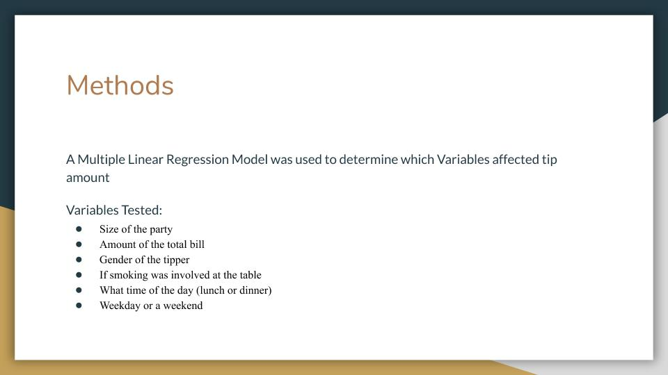
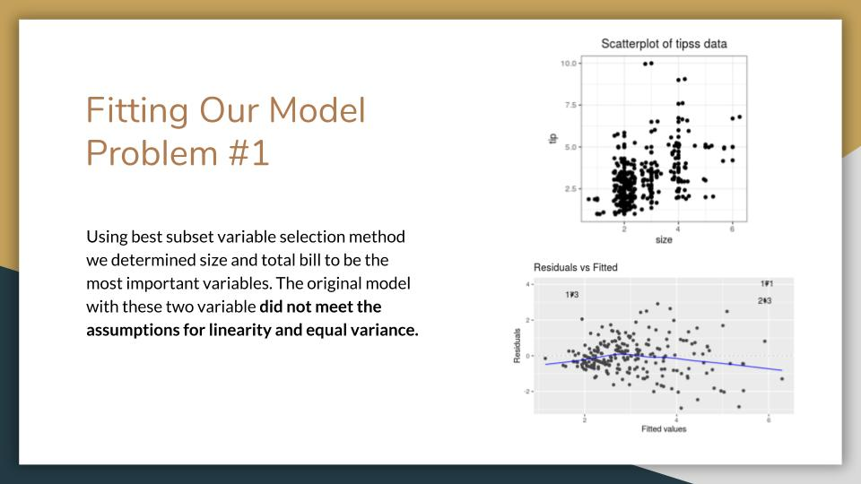

Below is a presentation I made that focuses on fitting a multiple linear regression model correctly. We had some struggles with the assumptions but using box cox and log transformations fixed the problems.

